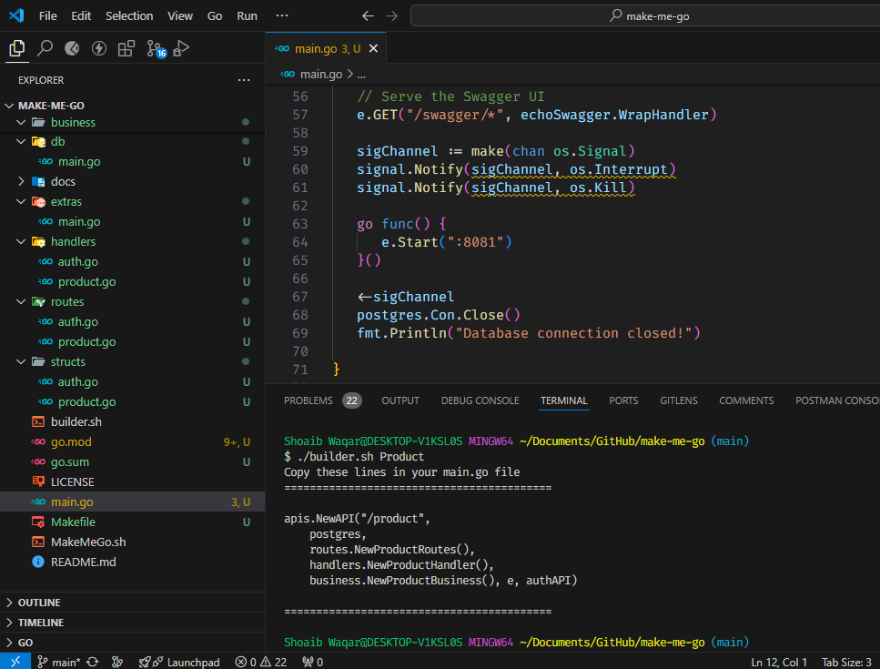

# Make Me Go

A couple of shell scripts to help setup the whole project.<br>

The Templater contains:
1. Echo Framework.
2. JWT Authentication.
3. Swagger for Documentation.
4. A simplistic Project structure.

The Templater will have:
1. Microservice support (actor/producer framework).
2. Different API frameworks support.
3. Chat Socket Template.
4. Docker Support.
5. Windows Support.


## Pre-req
Under the assumption that Go (Golang) is already installed on your system.
Just clone the repo 
```console
git clone github.com/hassan-algo/make-me-go
```
give execute permissions to the scripts
```console
chmod +x ./MakeMeGo.sh
chmod +x ./builder.sh
```
## Project Initialization
run the initializer script
```console
./MakeMeGo.sh
```
which will give you a response like this
```bash
==========================================

./builder.sh <Component name>
first letter of Component Should be Uppercase

==========================================
paste the following lines in .env

# local postgres
localHost="localhost"
localPort="5432"
localUser="<localuser>"
localPassword="<localpassword>"
localDbname="<localdb>"

# live postgrer
liveHost="<liveServer>"
livePort="5432"
liveUser="<liveuser>"
livePassword="<password>"
liveDbname="<db>"

==========================================
Run the following Commands by copying and pasting
==========================================
go mod init example.com
go get -u github.com/swaggo/swag/cmd/swag
go get -u github.com/swaggo/echo-swagger
go get github.com/golang-jwt/jwt
go get github.com/spf13/viper
go get github.com/labstack/echo
go get github.com/aws/aws-sdk-go/aws
go get github.com/anthdm/hollywood/actor
swag init
go mod tidy
make run
```
make the .env file and add the postgres credentials.
<br/>
Now, run the following commands
```console
go mod init example.com
go get -u github.com/swaggo/swag/cmd/swag
go get -u github.com/swaggo/echo-swagger
go get github.com/golang-jwt/jwt
go get github.com/spf13/viper
go get github.com/labstack/echo
go get github.com/aws/aws-sdk-go/aws
go get github.com/anthdm/hollywood/actor
swag init
go mod tidy
make run
```

<br />
<hr />
<br />

## Component Builder
To build any component just run the command 
```console
./builder.sh <ComponentName>
```
_Note: the component needs to have Pascal casing (eg. NewComponent)_

<br>

<br>
